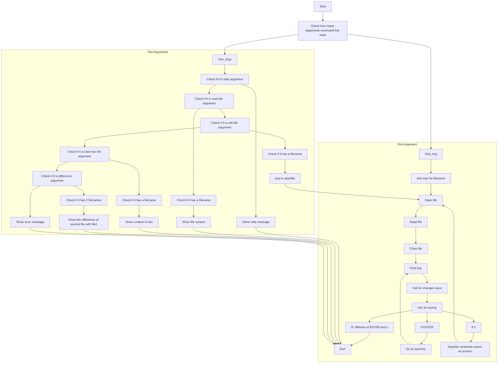

```mermaid
flowchart TD

   Start --> Check_Arguments["Check how many arguments command line have"]

   Check_Arguments --> One_Arg
   Check_Arguments --> Two_Args

   End["End"]

   subgraph One Argument
       One_Arg --> Ask_Filename["Ask user for filename"]
       Ask_Filename --> Open_File["Open file"]
       Open_File --> Read_File["Read file"]
       Read_File --> Close_File["Close file"]
       Close_File --> Print_Line["Print line"]
       Print_Line --> NextLineInput["Ask for changes input"]
       NextLineInput --> Ask_Save["Ask for saving"]
       Ask_Save --> ifS["If "s""]
       Ask_Save --> ifEnter["If ENTER"]
       Ask_Save --> ifNotEnter["IF different of ENTER and s"]
       ifEnter --> Next_Line["Go to next line"] --> Print_Line
       ifNotEnter --> End
       ifS --> SaveFile["Guardar contenido nuevo en archivo"] --> Open_File

       
   end

   subgraph Two Arguments
       Two_Args --> Check_Help["Check if it is help argument"]
       Check_Help --> Show_Help["Show help message"]
       Show_Help --> End
       Check_Help --> Check_Read["Check if it is read file argument"]
       Check_Read --> Check_Read_Filename["Check if it has a filename"]
       Check_Read_Filename --> Show_Content["Show file content"]
       Show_Content --> End
       Check_Read --> Check_Edit["Check if it is edit file argument"]
       Check_Edit --> Check_Edit_Filename["Check if it has a filename"]
       Check_Edit_Filename --> Jump_Open_File["jmp to openfile"] --> Open_File
       Check_Edit --> Check_View_Hex["Check if it is view hex file argument"]
       Check_View_Hex --> Check_View_Hex_Filename["Check if it has a filename"]
       Check_View_Hex_Filename --> Show_Hex_Content["Show content in hex"]
       Show_Hex_Content --> End
       Check_View_Hex --> Check_Diff["Check if it is difference argument"]
       Check_Diff --> Check_Diff_Filenames["Check if it has 2 filenames"]
       Check_Diff_Filenames --> Show_Diff["Show the difference of second file with file1"]
       Show_Diff --> End
       Check_Diff --> Show_Error["Show error message"]
       Show_Error --> End
   end

```
