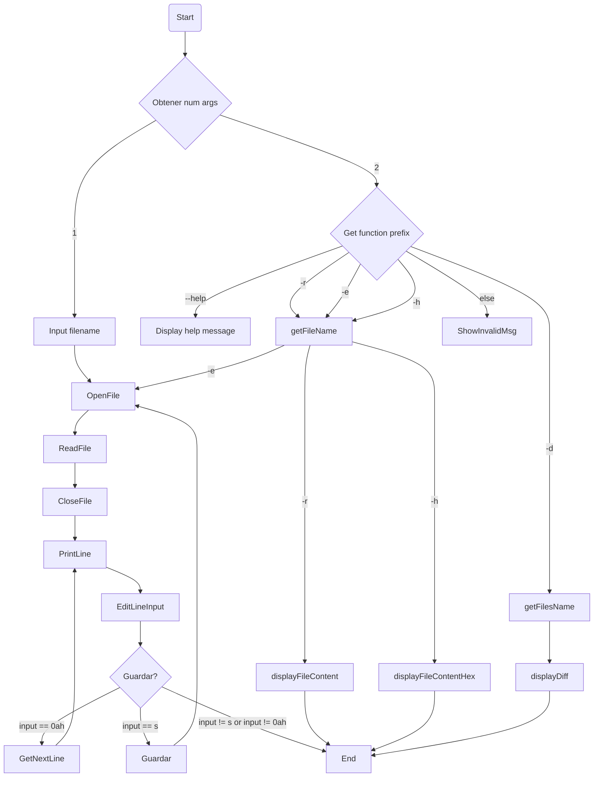

```mermaid
flowchart TD
    A(Start) --> B{Obtener num args}
    B -->|1| D[Input filename]
    D --> OpenFile --> ReadFile --> CloseFile

    CloseFile --> PrintLine --> EditLineInput
    EditLineInput --> AskSave{Guardar?}
    AskSave --> |input == 0ah| GetNextLine
    AskSave --> |input == s| Guardar
    AskSave --> |input != s or input != 0ah| End
    Guardar --> OpenFile
    GetNextLine --> PrintLine


    B -->|2| E{Get function prefix}
    E --> |--help| helpPrefix[Display help message]
    getFileName
    E --> |-r| getFileName --> |-r| displayFileContent --> End
    E --> |-e| getFileName --> |-e| OpenFile
    E --> |-h| getFileName --> |-h| displayFileContentHex --> End
    E --> |-d| getFilesName --> displayDiff --> End
    E --> |else| ShowInvalidMsg 

    End[End]
```
