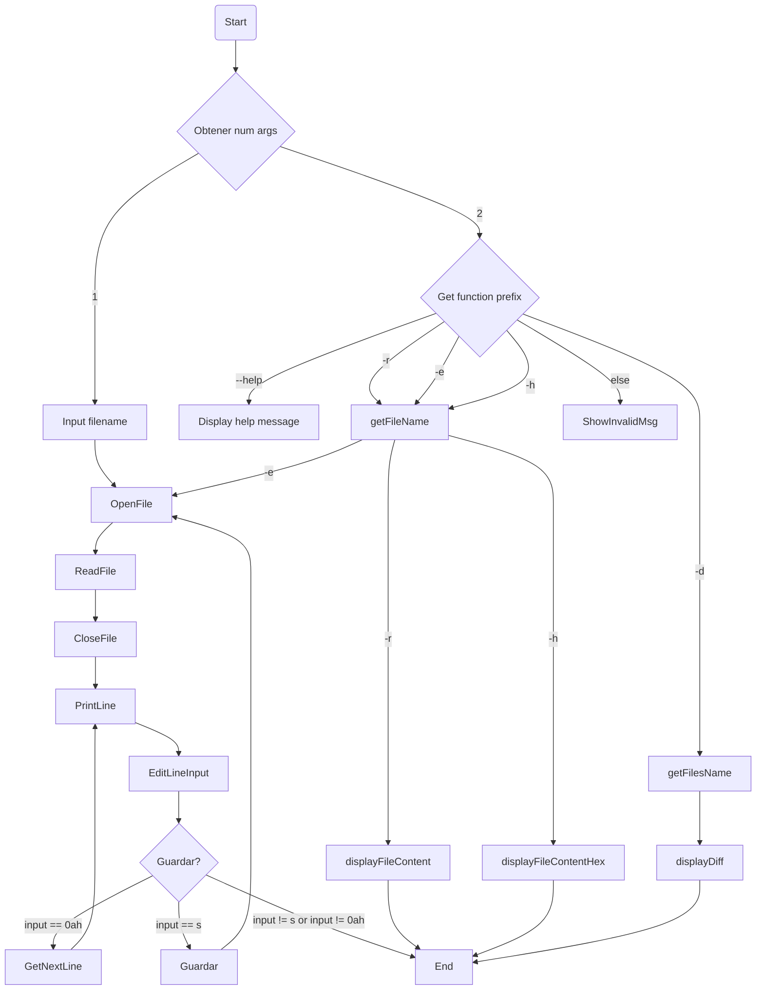

# NASM-X86_64-Text-Editor
Terminal based Text Editor written in Nasm x86_64 Assembly


## Manual de Uso

`./bite` Programa principal

`./bite --help` Mostrar mensaje de ayuda/manual de uso

`./bite -r <nombreArchivo>` Lee un archivo

`./bite -e <nombreArchivo>` Editar un archivo

`./bite -h <nombreArchivo>` Lee un archivo en formato hexadecimal

`./bite -d <nombreArchivo1> <nombreArchivo2>` Muestra la diferencia linea por linea de los archivos ingresados

---

### ./bite

```console
foo@bar:~$ Ingrese el nombre de archivo a editar: example.txt

-> Print Line

foo@bar:~$ Input changes to the line: 

foo@bar:~$ Input [ENTER (siguiente linea) / s (guardar) / otro (salir)]:
```
---

### ./bite --h | ./bite --help

```console
./bite Programa principal

./bite --help             Mostrar mensaje de ayuda/manual de uso

./bite -r <nombreArchivo> Lee un archivo

./bite -e <nombreArchivo> Editar un archivo

./bite -h <nombreArchivo> Lee un archivo en formato hexadecimal

./bite -d <nombreArchivo1> <nombreArchivo2> Muestra la diferencia linea por linea de los archivos ingresados
```

---

### ./bite -r filename.ext

```console
-> print Buffer
```

---

### ./bite -e filename.ext

```console
-> Print Line

foo@bar:~$ Input changes to the line: 

foo@bar:~$ Input [ENTER (siguiente linea) / s (guardar) / otro (salir)]:
```
---

### ./bite -h filename.ext

```console
-> print buffer in hex
```

---

### ./bite -d filename1.ext filename2.ext

```console
-> printLine
foo@bar:~$ (ENTER)
```

---

## Restrictions

- Los archivos deben estar en el mismo directorio.
- Los archivos no deben sobrepasar 4kb, si lo hace, solo mostrará los primeros bytes.
- Los archivos deben estar previamente creados.

---

## Flow Diagram

